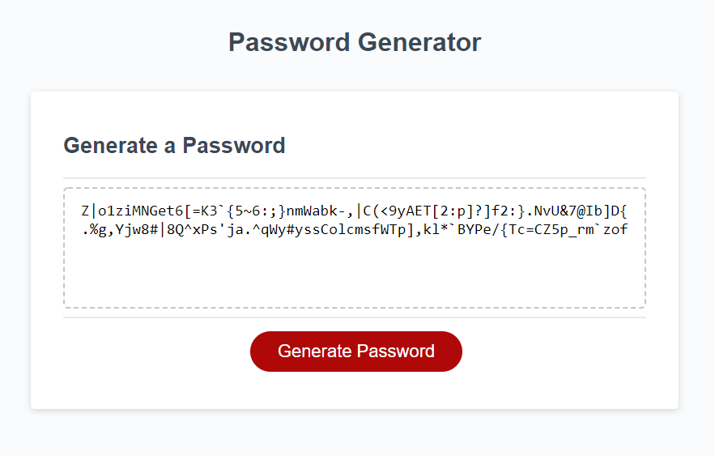

# PasswordGenerator
Basic password generator webpage using window.crypto (or window.msCrypto, or Math.random). 8-124 chars, supports lowercase, uppercase, numeric, and special characters

# V2 - window.crypto() + RegEx
V2 uses a window.crypto() (if available) to create an unsigned 8 bit int and use that int as a char code. If the resulting char fits the regular expression defined by user inputs, that char is added to the output password, until the password length is reached.

# V1 - Math.random
V1 used a for loop and Math.random() to select a number of chars from a concatenate string of user-desired characters.

[https://jodoedjr.github.io/PasswordGenerator/](https://jodoedjr.github.io/PasswordGenerator/)
